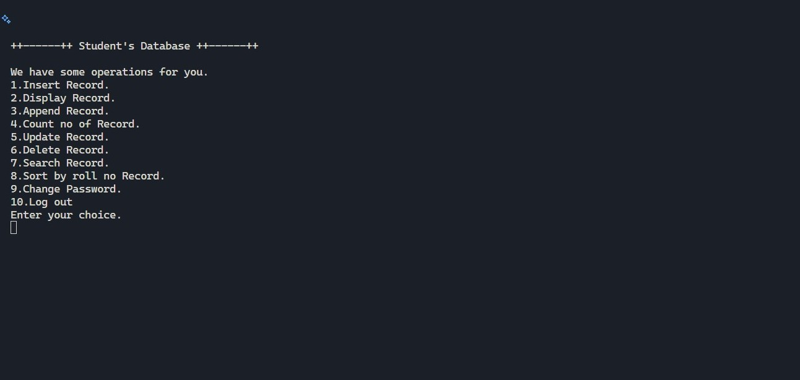

<div align="center">

# 🎓 Student Database Management System in C
A simple but powerful **Console-based Student Database Management System software** in C
It manages student records with password protection and provides features like add, update, delete, search, and sort.

---


</div>

## 🖼️ Preview


---

## 🚀 Features
- 🔑 Password protected login system  
- ➕ Add new student records  
- 📋 Display all student records in table format  
- 📥 Append new records to existing file  
- 🔍 Search student by roll number  
- ✏️ Update student details  
- ❌ Delete student record  
- 📊 Sort students by total marks (descending order)  
- 🔐 Change password functionality  
- 🧮 Count total records in the database

---

## 📂 Project Structure
```
StudentDatabase-C/
│── main.c # Source code
│── Student_database.txt # Stores student records (binary format, not human-readable)
│── password.txt # Stores login password
│── README.md # Project documentation
│── LICENSE # Open-source license (MIT recommended)
```

---

## 🛠️ How to Run

1. Clone the repository:
  ```bash
  git clone https://github.com/aamir-m-codes/StudentDatabase-C.git
  ```
2. Compile the code:
  ```bash
  gcc main.c -o studentdb
  ```
3. Run the program:
  ```bash
  ./studentdb
  ```

---

## 📊 Sample Output
  ```bash

++------++ Student's Database ++------++

We have some operations for you.        
1.Insert Record.
2.Display Record.
3.Append Record.
4.Count no of Record.
5.Update Record.
6.Delete Record.
7.Search Record.
8.Sort by roll no Record.
9.Change Password.
10.Log out
Enter your choice.
  ```
  
  ```bash
          _________________________Student's Records_________________________

        R.No    Student Name    sub_1   sub_2   sub_3   Total   Percentage 
         1            Adam      98      92      83      273     91.00      
         2             Eve      70      93      92      255     85.00  
  ```
---

## 📜 License
This project is licensed under the MIT License – see the [LICENSE](LICENSE) file for details.
